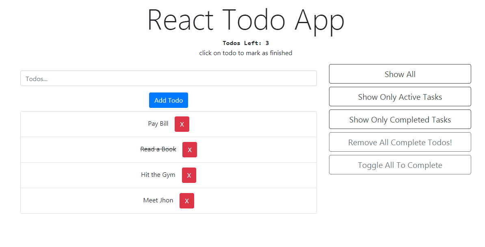

# React Todo App

A React Todo App 

## Preview

[DEMO](https://vishalj95.github.io/react-todo-app/)

## Features

1.  Add todo

2.  Keep trak of number of todo left

3.  Mark as complete

4.  Delete todo item

5.  Toggle todo list to
- Show All Todos
- Show Only Active Todos
- Show Only Complete Todos
- Remove All Complete todos
- Toggle All Todo To Active/Complete

## Language used

ReactJS ,
[Bootstrap4](http://getbootstrap.com/) ,
Shortid package 